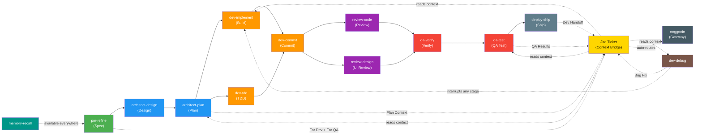

# enggenie - The Right Expert for the Right Moment

> Role-based skills for AI coding assistants across the entire software development lifecycle (SDLC). Your AI assistant becomes a PM, Architect, Developer, Code Reviewer, QA Engineer, and DevOps specialist - all in one plugin.

**What's a "skill"?** A skill is a set of instructions that teaches your AI coding assistant to behave like an expert in a specific area. Skills activate automatically based on what you're doing - you don't need to invoke them manually.

## Why enggenie?

Most AI coding tools only help with one thing: writing code. But software engineering is more than coding. You also need to:

- **Plan features** before building them
- **Design architecture** before coding
- **Write tests first** (not after)
- **Debug systematically** (not by guessing)
- **Review code** with technical rigor
- **Test like QA** (not like a developer)
- **Ship with confidence** (commits, PRs, deployment)

**enggenie makes your AI assistant an expert at ALL of these.** Each skill is a domain expert that activates automatically based on what you're doing.

## Highlights

- **14 skills** covering the entire software development lifecycle
- **7 expert roles** - PM, Architect, Dev, Reviewer, QA, Deploy, Memory
- **Model recommendations** - each skill suggests the optimal model (opus/sonnet/haiku) for best results
- **Zero configuration** - skills activate automatically based on your intent
- **Multi-platform** - works with Claude Code, Cursor, GitHub Copilot CLI, Google Gemini CLI, and OpenCode
- **Team customizable** - spec templates, commit format, estimation method, all configurable
- **Jira-powered handoffs** (optional) - PM → Dev → QA context flows through Jira tickets, so any role can pick up work cold
- **Unified artifacts** - all skill outputs live in one `enggenie/` directory with role prefixes (`spec_`, `design_`, `adr_`, `decision_`, `plan_`)
- **TDD enforced** - never lets your AI skip writing tests first (TDD = Test-Driven Development: write the test before the code)
- **Evidence-based** - never claims "done" without running the tests and showing proof
- **Subagent-powered** - dispatches specialized AI sub-agents (smaller focused assistants) for implementation, review, and QA

## Install

**Prerequisites:** [Node.js](https://nodejs.org) 18+ (for the `npx` installer)

**Any platform (Claude Code, Cursor, Gemini CLI, Copilot, OpenCode, and more):**

```bash
npx skills add badrusiddique/enggenie-skill
```

This auto-detects your installed AI coding tools and installs all 14 skills. The `skills` CLI is from [skillkit.sh](https://www.skillkit.sh/) (by Vercel).

**Claude Code only (native plugin system):**

```
/plugin marketplace add badrusiddique/enggenie-skill
/plugin install enggenie@badrusiddique-enggenie-skill
/reload-plugins
```

For platform-specific setup, see [Getting Started guides](#getting-started) below.

## What's Inside

| Role | Skill | What It Does | Try Saying... |
|------|-------|-------------|---------------|
| **PM** | `enggenie:pm-refine` | Generates specs, refines stories, estimates points | "Write a spec for user notifications" |
| **Architect** | `enggenie:architect-design` | Brainstorms approaches, writes architecture decision records | "What's the best caching strategy?" |
| **Architect** | `enggenie:architect-plan` | Creates phased implementation plans | "Create a plan from this spec" |
| **Dev** | `enggenie:dev-implement` | Executes plans with TDD subagents | "Execute the plan" |
| **Dev** | `enggenie:dev-tdd` | Enforces RED-GREEN-REFACTOR on every code change | "Add a validate email function" |
| **Dev** | `enggenie:dev-debug` | 4-phase systematic root cause investigation | "This test is failing, help me fix it" |
| **Reviewer** | `enggenie:review-code` | Dispatches code reviewer, handles PR feedback | "Review my changes before I push" |
| **Reviewer** | `enggenie:review-design` | Checks UI against design system, states, a11y | "Check the dashboard against our design" |
| **QA** | `enggenie:qa-verify` | Requires evidence before any completion claim | "Are the tests passing?" |
| **QA** | `enggenie:qa-test` | Playwright automation + manual browser testing | "Test the login flow as a QA engineer" |
| **Dev** | `enggenie:dev-commit` | Analyzes diffs, proposes conventional commit messages | "Create a commit message" |
| **Deploy** | `enggenie:deploy-ship` | PR creation, Jira handoff updates, branch completion | "Create a PR for this work" |
| **Memory** | `enggenie:memory-recall` | Cross-session context with 10x token savings | "What did we work on last session?" |
| **Gateway** | `enggenie` | Routes to the right skill when intent is ambiguous | "Help me with this feature" |

## How It Works

Skills activate automatically. You don't invoke them manually.

```
You say: "I want to build a user dashboard"
enggenie:architect-design activates -> brainstorms approaches

You say: "Create a plan for the dashboard"
enggenie:architect-plan activates -> generates phased implementation plan

You say: "Execute the plan"
enggenie:dev-implement activates -> TDD with subagent review per task

You say: "Are tests passing?"
enggenie:qa-verify activates -> runs tests, shows evidence

You say: "Create a PR"
enggenie:deploy-ship activates -> commits, pushes, creates PR
```

Each skill knows what comes next. The PM hands off to the Architect. The Architect hands off to the Dev. The Dev hands off to QA. QA hands off to Deploy. It's a complete pipeline.

That flow assumes one person driving the whole pipeline. When multiple people are involved across sessions, enggenie uses Jira as the handoff mechanism.

### Cross-Session Handoffs via Jira (optional — requires Atlassian MCP)

When different people handle different phases (PM specs it, Dev builds it, QA tests it), the Jira ticket becomes the context bridge:

```
PM runs enggenie:pm-refine
  → Writes "For Dev" and "For QA" sections to the Jira ticket

Dev picks up the ticket
  → Reads PM's handoff context, builds the feature
  → Writes "Dev Handoff" comment (PR link, what was built, QA focus areas)

QA picks up the ticket
  → Reads PM's "For QA" + Dev's "Dev Handoff"
  → Writes "QA Results" comment (pass/fail, bugs found, coverage)

Dev picks up bugs
  → Reads QA's bug reproduction steps, fixes, writes "Bug Fix" comment
```

Any skill can be picked up cold — just reference the Jira ticket and enggenie reads the full chain of context from previous roles. When Jira MCP is not available, handoff context saves to spec files instead and skills output the text for manual pasting.

For the full handoff protocol details, see [How It Works](docs/guides/how-it-works.md).

## Real-World Scenarios

When do you use which skill? Here's how enggenie maps to your daily SDLC activities:

| Scenario | What You Say | Skill That Activates |
|----------|-------------|---------------------|
| **Refinement & Specs** | | |
| PM drops a vague feature request | "I want to build email notifications for signups" | `enggenie:pm-refine` |
| Existing Jira ticket needs tightening | "Refine PROJ-1234, the AC is weak" | `enggenie:pm-refine` |
| Need story point estimate | "How big is this ticket? Break down the estimate" | `enggenie:pm-refine` |
| Tech research before committing | "Spike: should we use Redis or DynamoDB for sessions?" | `enggenie:pm-refine` |
| **Brainstorming & Architecture** | | |
| New feature design discussion | "We need real-time notifications, what are our options?" | `enggenie:architect-design` |
| Choosing between approaches | "Monolith vs microservice for billing - tradeoffs?" | `enggenie:architect-design` |
| Database schema design | "Design the schema for multi-tenant invoicing" | `enggenie:architect-design` |
| API contract design | "What should the REST API look like for this feature?" | `enggenie:architect-design` |
| **Planning & Task Breakdown** | | |
| Sprint planning breakdown | "Create an implementation plan from this spec" | `enggenie:architect-plan` |
| Phased delivery plan | "Break this into independently deployable phases" | `enggenie:architect-plan` |
| Execution roadmap | "Plan the work for this feature across 3 services" | `enggenie:architect-plan` |
| **Pair Programming (TDD)** | | |
| Writing new code from scratch | "Add a validateEmail function" | `enggenie:dev-tdd` |
| Adding a new endpoint | "Add a POST /invoices endpoint" | `enggenie:dev-tdd` |
| Building a React component | "Build a DataTable component with sorting" | `enggenie:dev-tdd` |
| Any feature work | "Implement the search filter from the spec" | `enggenie:dev-tdd` |
| **Execution (Plan-Driven)** | | |
| Executing an architect-plan | "Execute Phase 1 of the implementation plan" | `enggenie:dev-implement` |
| Multi-file coordinated changes | "Implement Task 2.3 from the plan" | `enggenie:dev-implement` |
| Following a spec step by step | "Start building from the spec, phase by phase" | `enggenie:dev-implement` |
| **Debugging** | | |
| Test failure investigation | "This test is failing, help me fix it" | `enggenie:dev-debug` |
| CI is broken | "CI passed locally but fails in pipeline" | `enggenie:dev-debug` |
| Production bug triage | "Users are seeing 500 errors on the dashboard" | `enggenie:dev-debug` |
| "It worked yesterday" | "This was passing before the merge, now it's broken" | `enggenie:dev-debug` |
| Flaky test | "This test passes sometimes and fails sometimes" | `enggenie:dev-debug` |
| **Git Commits** | | |
| Committing staged changes | "Commit this" | `enggenie:dev-commit` |
| Crafting a good commit message | "Help me write a commit message for these changes" | `enggenie:dev-commit` |
| **Code Review** | | |
| Reviewing a PR | "Review PR #42" | `enggenie:review-code` |
| Reviewing local changes | "Review my changes before I push" | `enggenie:review-code` |
| Addressing PR feedback | "I got 12 comments on my PR, help me address them" | `enggenie:review-code` |
| **UI/Design Review** | | |
| Checking implementation vs Figma | "Does this match the design?" | `enggenie:review-design` |
| Accessibility audit | "Check if this component is accessible" | `enggenie:review-design` |
| Responsive layout check | "Does this work on mobile, tablet, desktop?" | `enggenie:review-design` |
| **Dev Testing (Verification)** | | |
| Pre-PR sanity check | "Are we done? Prove it" | `enggenie:qa-verify` |
| Full verification | "Run all tests and show me proof" | `enggenie:qa-verify` |
| **QA / Manual Testing** | | |
| Playwright automation | "Write Playwright tests for the login flow" | `enggenie:qa-test` |
| Manual browser testing | "Walk through the checkout flow and screenshot each step" | `enggenie:qa-test` |
| Edge case testing | "What happens with empty inputs, double clicks, slow network?" | `enggenie:qa-test` |
| **Deployment & PRs** | | |
| Creating a PR | "Open a PR for this branch" | `enggenie:deploy-ship` |
| Release with changelog | "Ship this - tag, changelog, PR, the works" | `enggenie:deploy-ship` |
| **Cross-Session Memory** | | |
| Recalling past decisions | "What pattern did we use last time for caching?" | `enggenie:memory-recall` |
| Finding prior art | "Have we built a notification system before?" | `enggenie:memory-recall` |
| **Jira-Powered Handoffs** | | |
| Pick up a ticket cold | "Pick up PROJ-1234" | `enggenie` (gateway auto-detects phase) |
| PM hands off to Dev via Jira | "Write the handoff context to the ticket" | `enggenie:pm-refine` |
| Dev hands off to QA via Jira | "Create a PR and update the ticket for QA" | `enggenie:deploy-ship` |
| QA writes results back to Jira | "Write QA results to the ticket" | `enggenie:qa-test` |
| **Don't Know Where to Start** | | |
| General entry point | "I need to work on the billing feature" | `enggenie` (gateway) |

For detailed examples with terminal output, see [All Skills Usage Examples](docs/skills/usage-examples.md).

## What Makes enggenie Different

### Test-Driven Development (TDD) - Enforced, Not Optional
TDD means writing a test first, then writing the code to make it pass, then cleaning up. enggenie:dev-tdd ensures your AI follows this cycle (called RED-GREEN-REFACTOR) every time. No exceptions. If it catches itself writing code first, it deletes it and starts over.

### Evidence Before Claims
enggenie:qa-verify prevents your AI from saying "tests pass" without actually running them. Every claim requires proof: command output, exit codes, failure counts.

### Systematic Debugging - No Guessing
enggenie:dev-debug follows a 4-phase investigation: Investigate, Find Pattern, Test Hypothesis, Fix. After 3 failed fix attempts, it escalates as an architecture problem instead of thrashing.

### Full Spec-to-Ship Pipeline
Other tools help with coding. enggenie helps with the ENTIRE workflow:
1. **PM** writes the spec with estimation
2. **Architect** designs the approach and plans implementation
3. **Dev** builds it with TDD and subagent review
4. **Reviewer** checks code quality and design compliance
5. **QA** tests from the user's perspective
6. **Deploy** commits, creates PRs, updates Jira

When different people handle different phases, the Jira ticket carries context between roles automatically (see [Cross-Session Handoffs](#cross-session-handoffs-via-jira-optional--requires-atlassian-mcp) above).

### Phased Deployment
Multi-service features are broken into independently deployable phases. Each phase has a readiness checklist. No big-bang releases.

## Getting Started

Pick your platform:

- **[Claude Code](docs/getting-started/claude-code.md)** - Full setup guide with examples
- **[Cursor](docs/getting-started/cursor.md)** - Full setup guide
- **[GitHub Copilot CLI](docs/getting-started/copilot-cli.md)** - Full setup guide
- **[Google Gemini CLI](docs/getting-started/gemini-cli.md)** - Full setup guide
- **[OpenCode.ai](docs/getting-started/opencode.md)** - Full setup guide

### Quick Start

```bash
# 1. Install (works with any AI coding tool)
npx skills add badrusiddique/enggenie-skill

# 2. Open any project
cd your-project

# 3. Start working - skills activate automatically
# Try: "Add a function that validates email addresses"
# enggenie:dev-tdd will enforce RED-GREEN-REFACTOR

# Try: "This test is failing, help me fix it"
# enggenie:dev-debug will enforce systematic investigation
```

## Examples

See real-world walkthroughs of each skill in action:

- [Full Feature Walkthrough](docs/examples/full-feature-walkthrough.md) - Idea to spec to plan to code to test to ship
- [Debugging Session](docs/examples/debug-session.md) - Systematic root cause investigation
- [Code Review Session](docs/examples/code-review-session.md) - Requesting and receiving reviews
- [QA Testing Session](docs/examples/qa-testing-session.md) - Playwright + manual browser testing
- [All Skills Usage Examples](docs/skills/usage-examples.md) - Quick examples for every skill

## For Teams

enggenie adapts to your team's conventions:

- **Jira integration** - Handoff context flows through tickets automatically (requires Atlassian MCP)
- **Spec templates** - Use your team's format instead of the default
- **Commit format** - Conventional commits, emoji prefixes, Jira ticket references
- **Estimation method** - Fibonacci, T-shirt sizing, or linear
- **Architecture context** - Describe your system in CLAUDE.md

See [Team Setup Guide](docs/guides/team-setup.md).

**Want your team to use enggenie?** Share this one-liner:
```bash
npx skills add badrusiddique/enggenie-skill
```
It works with whatever AI coding tool they use. No configuration needed.

## Architecture



> Green = PM | Blue = Architect | Orange = Dev | Purple = Reviewer | Red = QA | Gray = Deploy | Brown = Debug | Teal = Memory | Yellow = Jira

## Plugin Discovery

enggenie is listed on multiple plugin directories across platforms:

| Directory | Platforms | URL |
|-----------|----------|-----|
| skills.sh | All (18+ tools) | [skills.sh](https://skills.sh) |
| ClaudePluginHub | Claude Code | [claudepluginhub.com](https://www.claudepluginhub.com) |
| Gemini Extensions Gallery | Gemini CLI | [geminicli.com/extensions](https://geminicli.com/extensions/) |
| Cursor Marketplace | Cursor | [cursor.com/marketplace](https://cursor.com/marketplace) |
| SkillsMP | All | [skillsmp.com](https://skillsmp.com) |

See the [full plugin discovery guide](docs/guides/plugin-discovery.md) for all directories and submission details.

## Contributing

See [CONTRIBUTING.md](CONTRIBUTING.md). We welcome contributions - especially new reference docs, platform adapters, and bug reports.

## License

[MIT](LICENSE)

---

Built by [Badru Siddique](https://github.com/badrusiddique).
