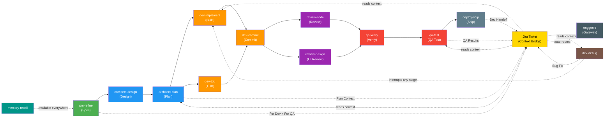

# How enggenie Works

Technical architecture of the enggenie skill suite: how skills activate, how they connect, how subagents are dispatched, and how memory integrates.

## How Skills Auto-Activate

Skills have a `description` field in their YAML frontmatter. This description is optimized for CSO (Claude Skill Orchestration) -- the system that matches user intent to available skills.

When a user says "this test is failing," the orchestrator matches that intent against every installed skill's description. `dev-debug`'s description -- "Use when encountering any bug, test failure, or unexpected behavior" -- wins the match. The skill activates without the user invoking it by name.

Good descriptions are specific about triggers. They use the exact phrases a user would say, not abstract capability summaries. "Use when writing any code" triggers more reliably than "enforces development best practices."

## The Gateway Skill

When intent is ambiguous, the `enggenie` gateway skill activates. It routes the user to the correct specialist:

- "I want to build X" -- routes to pm-refine
- "Let's brainstorm" -- routes to architect-design
- "Create a plan" -- routes to architect-plan
- "Execute the plan" -- routes to dev-implement
- "This is broken" -- routes to dev-debug
- "Review my code" -- routes to review-code
- "Test this feature" -- routes to qa-test
- "Ship it" -- routes to deploy-ship

If the gateway cannot determine intent, it asks the user to choose from six categories: plan, build, fix, review, test, or ship.

The gateway also handles Jira ticket routing. When a user says "Pick up PROJ-1234," the gateway reads the ticket, detects its phase (fresh, has PR, has bugs), and routes to the appropriate skill automatically.

The gateway defines what is explicitly outside the suite: quick questions, simple edits, file exploration, and git queries bypass enggenie entirely.

## Skill Interconnection Map



> Green = PM | Blue = Architect | Orange = Dev | Purple = Reviewer | Red = QA | Gray = Deploy | Brown = Debug | Teal = Memory | Yellow = Jira

Skills consume each other's outputs through explicit handoffs:

- architect-plan reads the spec file produced by pm-refine
- dev-implement reads the plan file produced by architect-plan
- qa-test maps scenarios to acceptance criteria from the spec
- deploy-ship uses evidence from qa-verify in the PR description

Each skill offers the next step but never auto-invokes it. The user decides when to advance.

## Cross-Session Handoffs via Jira (optional)

When different people handle different SDLC phases (PM specs it, Dev builds it, QA tests it), they work in separate sessions with no shared context. The Jira ticket becomes the persistent context bridge.

### How It Works

Each role reads from and writes to the Jira ticket using structured comment sections:

| Role | Reads | Writes |
|------|-------|--------|
| **PM** (pm-refine) | — | "For Dev" and "For QA" sections in ticket description |
| **Architect** (architect-plan) | PM's handoff context, spec link | "Implementation Plan" comment with plan file link and design decisions |
| **Dev** (dev-implement) | PM's "For Dev", Architect's plan link | — |
| **Deploy** (deploy-ship) | — | "Dev Handoff" comment (PR link, what was built, spec deviations, QA focus areas) |
| **QA** (qa-test) | PM's "For QA", Dev's "Dev Handoff" | "QA Results" comment (pass/fail, bugs, coverage) |
| **Debug** (dev-debug) | QA's bug reproduction steps | "Bug Fix" comment (root cause, fix PR, regression test) |

### Cold-Start Capability

Any skill can be picked up by someone with zero prior context. Reference a Jira ticket and the skill reads the full chain of handoff comments from previous roles. The gateway (`enggenie`) auto-detects the ticket's phase:

- No PR exists → routes to architect-plan or dev-implement
- Has a PR → routes to qa-test or review-code
- Has bugs in QA Results → routes to dev-debug

### Graceful Degradation

Jira integration requires the Atlassian MCP. When MCP is not available:
- Handoff context is saved in spec files instead of Jira
- Skills output the handoff text for manual pasting into Jira
- No errors, no blocking — the workflow continues

## Unified Artifact Directory

All skill-generated files save to a single `enggenie/` directory at the project root with role prefixes:

```
enggenie/
  spec_user-notifications.md       # pm-refine
  design_notification-system.md    # architect-design (brainstorm)
  adr_001-websocket-vs-sse.md      # architect-design (ADR)
  decision_auth-provider.md        # architect-design (decision)
  plan_user-notifications.md       # architect-plan
```

This keeps all feature artifacts co-located and discoverable. If a project has an existing convention configured in CLAUDE.md, skills follow that instead.

## Subagent Architecture

Several skills dispatch subagents -- fresh, focused agents given a single task with self-contained context. This is the core execution pattern for complex skills.

### Fresh Agent Per Task

Each subagent receives its full context inline. No file references. No "read the plan file." The subagent prompt is self-contained because subagents do not share state with the parent agent or with each other.

### Two-Stage Review Gate

dev-implement enforces a two-stage review on every task:

1. **Spec Reviewer** -- Does the implementation match the requirements? Anything missing? Anything extra (scope creep)?
2. **Code Quality Reviewer** -- Clean code? No bugs? Good tests? YAGNI?

Both gates must pass before a task is marked complete. Issues found by either reviewer go back to the implementer for fixes, then through the gate again.

### Parallel Dispatch

Independent tasks within the same phase can run in parallel (max 3 concurrent agents). Independence must be real -- if task B might import something from task A, they run sequentially. After parallel tasks complete, the full test suite runs to catch integration conflicts.

### 14 Agent Prompt Templates

Each subagent type has a dedicated prompt template defining its instructions, constraints, and output format:

| Skill | Templates |
|-------|-----------|
| pm-refine | refinement-agent, qa-planner-agent, spec-reviewer-agent |
| architect-plan | explorer-agent, doc-discovery-agent, plan-reviewer-agent |
| dev-implement | implementer-agent, spec-reviewer-agent, quality-reviewer-agent |
| dev-debug | investigator-agent |
| review-code | code-reviewer-agent |
| review-design | design-reviewer-agent |
| qa-test | qa-automation-agent, qa-manual-agent |

Templates live in `agents/` subdirectories within each skill.

## Model Selection

Subagent model is chosen by task complexity, not by default:

| Model | When Used | Example |
|-------|-----------|---------|
| haiku | Simple, low-ambiguity tasks | Memory search, doc discovery |
| sonnet | Judgment-intensive tasks | Code review, spec review, implementation, investigation |
| opus | Holistic review across all changes | Final review after all tasks in a plan complete |

The rule: if you are unsure whether a task is simple or complex, it is complex. Use sonnet.

pm-refine uses sonnet for its refinement, QA planner, and spec reviewer subagents. It uses haiku only for the optional memory search. architect-plan uses sonnet for exploration and plan review, haiku for doc discovery. dev-implement uses haiku for simple implementer tasks, sonnet for complex ones, and opus for the final cross-task review.

## Memory Integration

memory-recall provides cross-session context via the claude-mem plugin's MCP tools. It uses a 3-layer retrieval pattern to minimize token usage:

1. **Search** -- Query the index, get lightweight results (~50-100 tokens each)
2. **Timeline** -- Get chronological context around interesting results
3. **Fetch** -- Pull full details only for filtered, relevant observations

### Graceful Degradation

Memory is optional. Every skill that uses it follows the same pattern:

```
IF memory-recall MCP tools available:
  Search for relevant context
  Use findings in skill logic
ELSE:
  Skip silently -- proceed without memory
  No error message, no mention of missing feature
```

Four skills actively search memory: architect-design ("have we designed something similar?"), architect-plan ("what patterns did we use last time?"), pm-refine ("have we built something similar?"), and dev-debug ("have we seen this bug pattern before?").

When claude-mem is not installed, these skills produce the same outputs -- they just lack historical context.

### AST-Based Code Exploration

memory-recall also exposes token-efficient code exploration through AST parsing:

- `smart_search` -- Find symbols across the codebase (~2-6k tokens vs ~39-59k for a full explore agent)
- `smart_outline` -- Get file structure (~1-2k tokens vs ~12k+ for a full file read)
- `smart_unfold` -- See a specific function implementation (~400-2k tokens)

## TodoWrite Integration

qa-verify integrates with TodoWrite for progress tracking. When verification is needed, it creates a todo item ("Verify: [specific claim] with evidence") and marks it complete only after evidence is gathered and stated. This provides a visible audit trail of what was verified and when.

## Platform Adaptation

Skills use Claude Code tool names by default. Four platform adapter reference docs provide tool mappings for other platforms:

- `references/cursor-tools.md`
- `references/copilot-tools.md`
- `references/gemini-tools.md`
- `references/opencode-tools.md`

These adapters translate tool names and interaction patterns so the same skills work across platforms.
